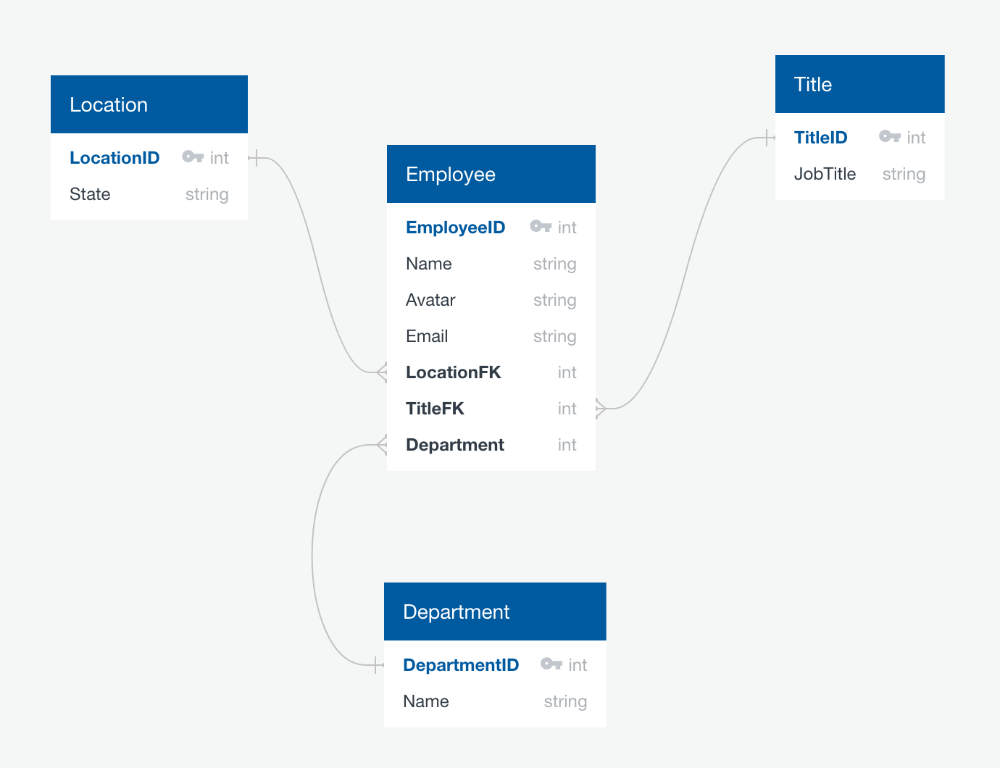

# Postlight Employee API

The employee directory API for the Postlight code challenge submission for the Full Stack Engineer position. The frontend for this project can be found [here](https://github.com/jtx007/postlight-employee-directory)

## Getting Started

### Prerequistes

This api uses Ruby on Rails to serve a RESTful API to the frontend. I'm using Ruby version 3.0.0 and Rails version 6.1.4. I'm also using PostGres App for Mac as a database GUI so make sure that you have that and PostgresSQL installed on your machine as well.

### Tech Stack

- [Ruby 3.0.0](https://www.ruby-lang.org/en/documentation/)
- [Rails 6.1.4](https://edgeguides.rubyonrails.org/6_0_release_notes.html)
- [PostGresSQL/PostGres App](https://postgresapp.com/)
- [ActiveRecord](https://guides.rubyonrails.org/active_record_basics.html)

### Development

In order to work with this API, turn on your PostGres app instance, `cd` into the project directory and then enter the following into your CLI:

```
bundle install
bundle update
rake db:create
rake db:migrate
rake db:seed
rails s
```

The api will now be served on http://localhost:3000/.

### Schema

Here is a visualization of the current database schema. This is subject to change as time goes on.
The database has some preliminary data to be seeded courtesy of the [Faker](https://github.com/faker-ruby/faker) gem.



- I used the [Jbuilder](https://github.com/rails/jbuilder) gem to build out the JSON responses and setup relations between employees and their locations, titles, and departments. The db is setup in a way where as the office expands, a company can easily add more options for locations, job titles, and departments.
- Employee Result were paginated and managed by the [Pagy](https://github.com/ddnexus/pagy) gem with 10 results per page.
- Employee Search is configured via [pg_search](https://github.com/Casecommons/pg_search), and allows exact searches amongst all of the Employee columns as well as it's associations.

### Relevant endpoints

- GET api/v1/employees
- GET api/v1/employees/:id
- POST api/v1/employees
- PUT api/v1/employees/:id
- DELETE api/v1/employees/:id
- GET api/v1/locations
- GET api/v1/departments
- GET api/v1/titles

### Stretch Features

- Unit test coverage
- Use of Elastic Search or Algolia for better fuzzy searching
- Use of GraphQL
- More descriptive error handling
